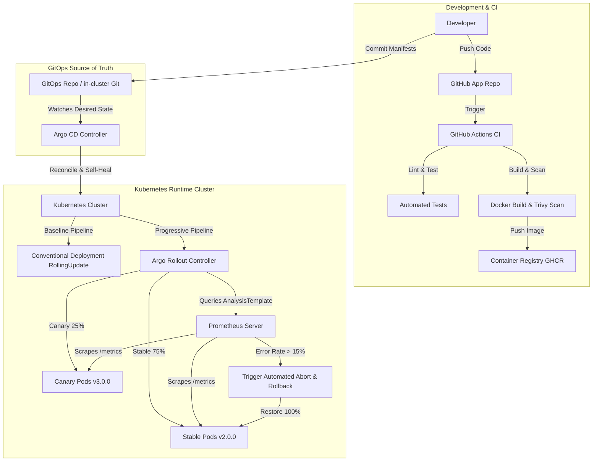
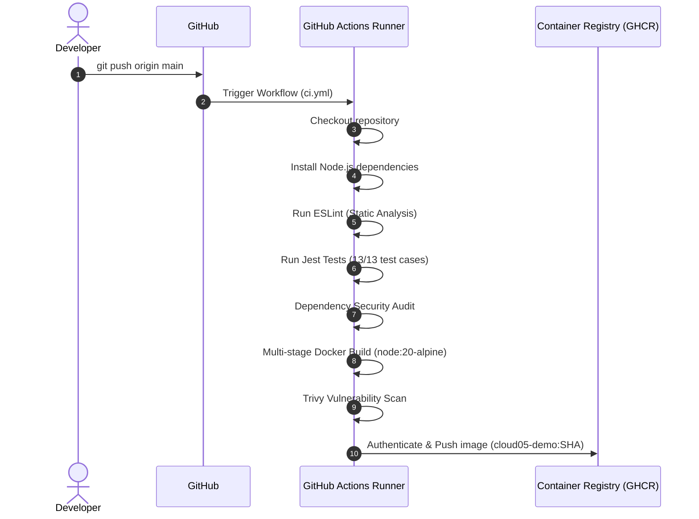
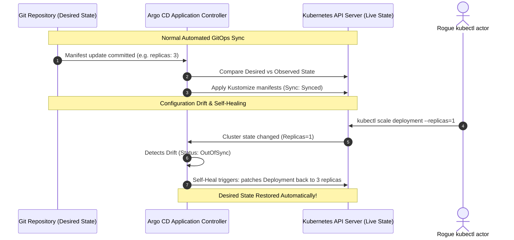
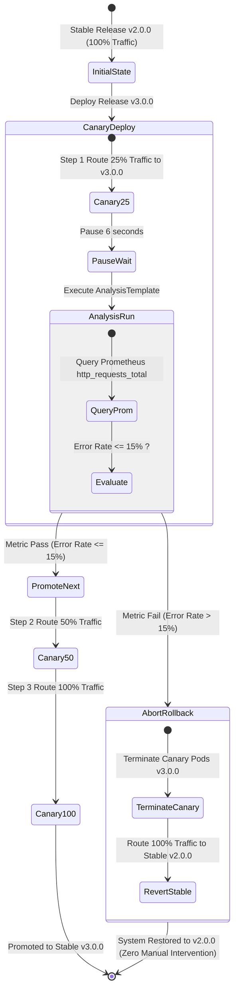
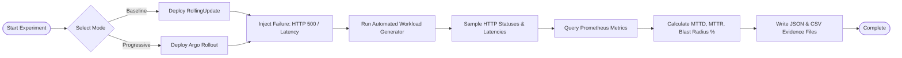

# CLOUD-05: Architecture & Design Specification

## 1. System Architecture Overview

The CLOUD-05 release safety architecture integrates developer workflows, containerization, declarative GitOps reconciliation, progressive delivery canary controllers, and metric-based automated rollback.

---

## 2. GitHub Actions CI Pipeline

---

## 3. GitOps Continuous Reconciliation & Drift Flow

---

## 4. Progressive Delivery & Automated Rollback Flow

---

## 5. Experiment Evaluation Pipeline

